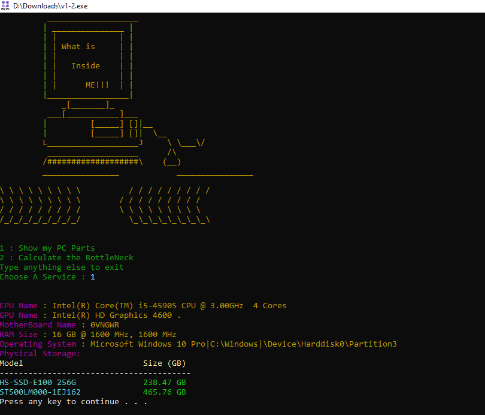

# MyPC Tool

#### This is A tool that will help windows users to fastly see their system compnents names such as cpu name , generation and number of cores. 
#### It is mainly devoloped for non-technical users because the problem was that to get you system component specificaation you have to at least search for it in three pages with this tool the operation now is much easier.
#### A second functionality is When you see the you sstem is operating poorly you will be able to identify the part of the system that cause this poor preformance by "Calculating Bottleneck" so t will be useful for both normal users and technechian and helpDesck employees.

## Table of Content:
- [Installation](#installation)
- [Usage](#usage)
- [Contributing](#contributing)
- [License](#license)

## Prerequisites
- Windows Operating System.

## Installation
1. Clone the repository:

2. git clone https://github.com/qa2me/UsefullTools.git

3. cd UsefullTools

4. v1-2.exe

## Usage

To use the MyPC Tool, follow these steps:

1. enter your choice 1,2 or any other number to exit.
2. if 1 is entered monitor you system component.
3. if 2 is entered see the BottleNeck persentage and causer (CPU || GPU).
4. if other number selected terminate and exit.

## SnapShots

## Last Updated
This README was last updated on [20/7/2025].

## Credits
Thanks to the following contributors:
- [Qais AL-Badowi](https://github.com/qa2me)
## License

This application is provided as a compiled executable (.exe) and is free for personal use. 

You are **not allowed** to:
- Modify, reverse-engineer, decompile, or disassemble the application.
- Redistribute the application without explicit permission.
- Use the application for commercial purposes without a separate license agreement.

All rights are reserved by [Qais Al-Badowi (Qa2me)].

